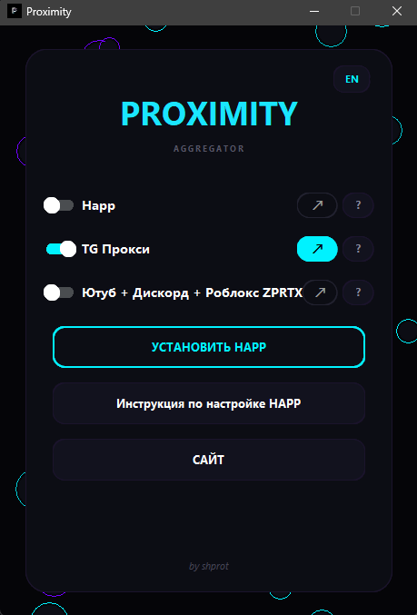

<pre>
 ───═▶   ██████╗ ██████╗  ██████╗ ██╗  ██╗██╗███╗   ███╗████████╗██╗   ██╗   ◀═───
 ───═▶   ██╔══██╗██╔══██╗██╔═══██╗╚██╗██╔╝██║████╗ ████║╚══██╔══╝╚██╗ ██╔╝   ◀═───
 ───═▶   ██████╔╝██████╔╝██║   ██║ ╚███╔╝ ██║██╔████╔██║   ██║    ╚████╔╝    ◀═───
 ───═▶   ██╔═══╝ ██╔══██╗██║   ██║ ██╔██╗ ██║██║╚██╔╝██║   ██║     ╚██╔╝     ◀═───
 ───═▶   ██║     ██║  ██║╚██████╔╝██╔╝ ██╗██║██║ ╚═╝ ██║   ██║      ██║      ◀═───
 ───═▶   ╚═╝     ╚═╝  ╚═╝ ╚═════╝ ╚═╝  ╚═╝╚═╝╚═╝     ╚═╝   ╚═╝      ╚═╝      ◀═───

</pre>

---

☑️ Объединяет различные инструменты обхода под одним капотом, устраняя необходимость в сложной ручной настройке.

---

---
### 🛠️ Интерфейс и управление Proximity

| Элемент | Функция | Описание |
| :---: | :--- | :--- |
| **`Ползунки`** | **Активация функций** | Главные переключатели режимов обхода. Напротив каждого ползунка есть дополнительная кнопка: • **Happ VPN** — открывает окно самого приложения Happ, если оно свернуто в системный трей.  ⚠️ **[Если по какой то причине ползунок отказывается работать, создайте свой ярлык на рабочем столе]**   • **Остальные** — мгновенно переводят на официальные страницы разработчиков софта. |
| **`ZPRTX`** | **Особая логика ползунка** | Включение тумблера запускает CMD-консоль движка.  1. Введите **`1`**, чтобы установить и запустить сервис обхода. 2. Напишите **`0`** и выйдите из консоли. 💡 *Обход продолжит работать в системе до тех пор, пока вы вручную не переведете ползунок в положение «ВЫКЛ».* |
| **`Кнопка`** | **Скачать и установить Happ** | Запускает **встроенный установщик**. |
| **`Кнопка`** | **Инструкция по настройке** | Подробный гайд по конфигурации VPN-модуля. Содержит 2 бесплатные ссылки на халявные сервера.  🔥 *Система полностью открыта - вы можете использовать абсолютно любые свои личные или купленные конфигурационные ссылки.* |
| **`RU / EN`** | **Смена локализации** | Мгновенно переключает язык всего интерфейса приложения (Русский / Английский) в один клик. |
| **`Свернуть`** | **Работа в фоне** | При скрытии главного окна приложение автоматически сворачивается в системный трей Windows, освобождая панель задач. |
| **`Закрыть`** | **Защита процессов** | Если вы попытаетесь полностью закрыть программу крестиком в момент, когда активна хотя бы одна из функций — система выведет предупреждение, чтобы защитить приложение от внезапного выключения. |

---
## 📌 Инструкция по созданию ярлыка

* **Создание:** Рабочий стол ➔ ПКМ ➔ Создать ➔ Ярлык ➔ Обзор ➔ Выбрать `Proximity.exe` ➔ Далее ➔ Готово
* **Размещение:** Созданный ярлык ➔ ⚠️ ОСТАВИТЬ НА РАБОЧЕМ СТОЛЕ.  
  *❌ Не перемещайте и не удаляйте его, так как приложение ищет этот ярлык в корне десктопа.*

---
### 🔐 Состав

| Инструмент | Назначение и технологии | Автор |
| :--- | :--- | :--- |
| 🌐 **Happ VPN** | продвинутый инструмент маршрутизации и конфигураций для управления трафиком. *Инструкция и установщик вшиты.* | [**Happ**](https://github.com/Happ-proxy) |
| ✈️ **TG Proxy** | Локальный MTProto-прокси для Telegram Desktop, который ускоряет работу Telegram, перенаправляя трафик через WebSocket-соединения. Данные передаются в том же зашифрованном виде, а для работы не нужны сторонние серверы. | [**Flowseal**](https://github.com/Flowseal) |
| 👾 **ZPRTX** | Сборка, объединившая в себе версию от **Lux1de** и версию от **Flowseal**. Вся утилита сведена к **1 стратегии `general (ALT)` для YouTube, Discord, Roblox**. | [**Shprot**](https://github.com/shprttx) |

### ⚖️ Лицензирование

Проект распространяется на условиях лицензии [MIT](https://github.com/shprttx/Proximity/blob/main/LICENSE)

