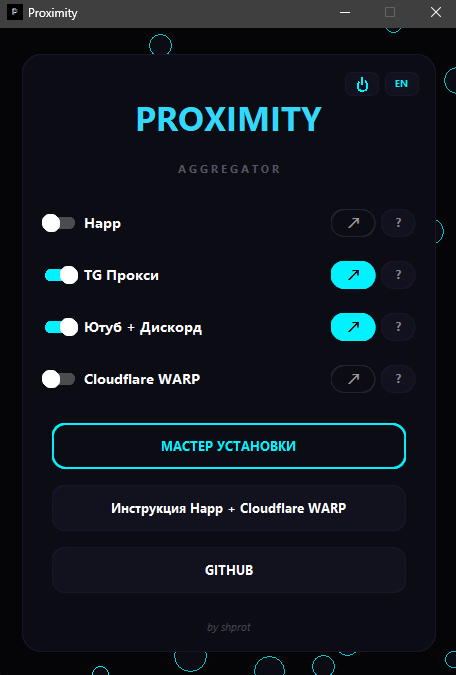

<pre>
 ───═▶   ██████╗ ██████╗  ██████╗ ██╗  ██╗██╗███╗   ███╗██╗████████╗██╗   ██╗   ◀═───
 ───═▶   ██╔══██╗██╔══██╗██╔═══██╗╚██╗██╔╝██║████╗ ████║██║╚══██╔══╝╚██╗ ██╔╝   ◀═───
 ───═▶   ██████╔╝██████╔╝██║   ██║ ╚███╔╝ ██║██╔████╔██║██║   ██║    ╚████╔╝    ◀═───
 ───═▶   ██╔═══╝ ██╔══██╗██║   ██║ ██╔██╗ ██║██║╚██╔╝██║██║   ██║     ╚██╔╝     ◀═───
 ───═▶   ██║     ██║  ██║╚██████╔╝██╔╝ ██╗██║██║ ╚═╝ ██║██║   ██║      ██║      ◀═───
 ───═▶   ╚═╝     ╚═╝  ╚═╝ ╚═════╝ ╚═╝  ╚═╝╚═╝╚═╝     ╚═╝╚═╝   ╚═╝      ╚═╝      ◀═───

</pre>

---

 Объединяет различные инструменты обхода под одним капотом, устраняя необходимость в сложной ручной настройке. Все утилиты от оригинальных разработчиков, ссылки на них указаны ниже.

---

---
### 🛠️ Интерфейс и управление Proximity

| Элемент | Функция | Описание |
| :---: | :--- | :--- |
| **`Ползунки`** | **Активация функций** | Главные переключатели режимов обхода. Напротив каждого ползунка есть дополнительная кнопка: • **Happ VPN** - открывает окно самого приложения Happ, если оно свернуто в системный трей.  ⚠️ **[Если по какой то причине ползунок отказывается работать, создайте свой ярлык на рабочем столе]**   • **Остальные** - мгновенно переводят на официальные страницы разработчиков софта. |
| **`Дискорд + Ютуб`** | **Особая логика ползунка** | Включение тумблера запускает выбор после которого вы перейдете в CMD-консоль нужного вам движка.💡 *Обход продолжит работать в системе до тех пор, пока вы вручную не переведете ползунок в положение «ВЫКЛ».* |
| **`Взаимосвязь Дискорд + Ютуб и WARP`** | **Особая логика модулей** | Движки тесно связаны для стабильной маршрутизации: • Включение **WARP** автоматически активирует ползунок **Дискорд + Ютуб**. • Выключение **Дискорд + Ютуб** мгновенно завершает работу клиента **WARP** и убивает его процесс. 💡 *Дискорд + Ютуб может работать автономно. Если отключить только ползунок WARP, утилита Дискорд + Ютуб продолжит стабильный обход.* |
| **`⏻ Отключение`** | **Выключатель всего** | Одним нажатием останавливает все активные модули (Happ, TG Proxy, WARP, Дискорд + Ютуб) по очереди - интерфейс не подвисает, даже если включено сразу несколько служб одновременно. Сопровождается красной ударной волной, расходящейся по фону приложения. |
| **`МАСТЕР УСТАНОВЩИК`** | **Универсальный сетап** | Открывает полностью переработанное компактное диалоговое окно для выборочной установки необходимых компонентов (**Happ VPN** или **Cloudflare WARP**). |
| **`Кнопка`** | **Инструкция по настройке** | Подробный гайд по конфигурации VPN-модуля и CloudFlare WARP Содержит 2 бесплатные ссылки на халявные сервера.  🔥 *Система полностью открыта - вы можете использовать абсолютно любые свои личные или купленные конфигурационные ссылки.* |
| **`RU / EN`** | **Смена локализации** | Мгновенно переключает язык всего интерфейса приложения (Русский / Английский) в один клик. |
| **`Свернуть`** | **Работа в фоне** | При скрытии главного окна приложение автоматически сворачивается в системный трей Windows, освобождая панель задач. |
| **`Закрыть`** | **Защита процессов** | Если вы попытаетесь полностью закрыть программу крестиком в момент, когда активна хотя бы одна из функций - система выведет предупреждение, чтобы защитить приложение от внезапного выключения. |

---
### 🔐 Состав

| Инструмент | Назначение и технологии | Автор |
| :--- | :--- | :--- |
| 🌐 **Happ VPN** | продвинутый инструмент маршрутизации и конфигураций для управления трафиком. *Инструкция и установщик вшиты.* | [**Happ**](https://github.com/Happ-proxy) |
| ✈️ **TG Proxy** | Локальный MTProto-прокси для Telegram Desktop, который ускоряет работу Telegram, перенаправляя трафик через WebSocket-соединения. Данные передаются в том же зашифрованном виде, а для работы не нужны сторонние серверы. | [**Flowseal**](https://github.com/Flowseal) |
| 🧡 **Cloudflare WARP** | Утилита, объединяющая функции VPN и безопасного DNS-резолвера. Ускоряет загрузку сайтов и открывает доступ к зарубежным ИИ-моделям (Gemini, Claude, ChatGPT). | [**Cloudflare, Inc.**](https://one.one.one.one) |
| 👾 **ZPRTX** | Сборка, объединившая в себе версию от **Lux1de** и версию от **Flowseal**. | [**Shprot**](https://github.com/shprttx) |
| 👾 **ZAPRET-DISCORD-YOUTUBE** | Оригинал от **Flowseal**. | [**Flowseal**](https://github.com/Flowseal) |

### ⚖️ Лицензирование

Проект распространяется на условиях лицензии [MIT](https://github.com/shprttx/Proximity/blob/main/LICENSE)

