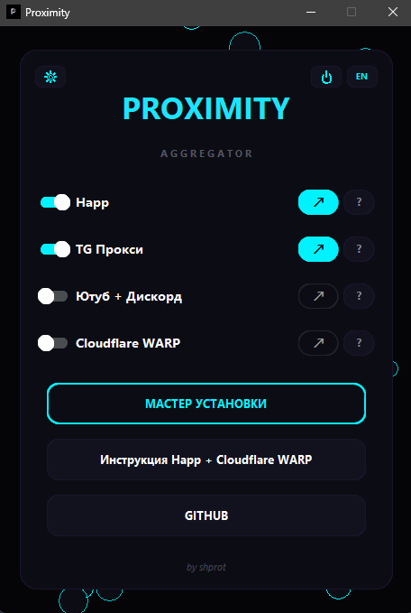
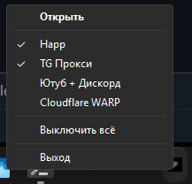
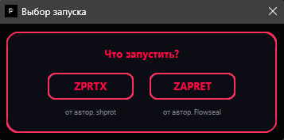
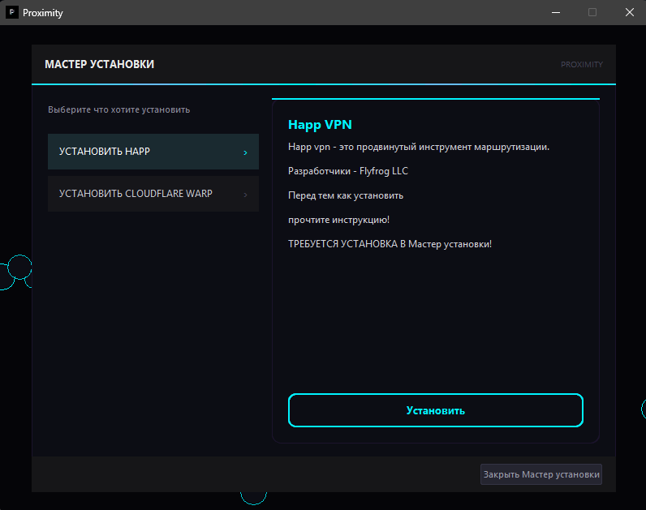
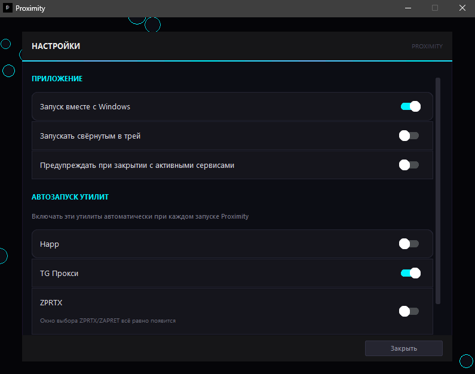

<pre>
 ───═▶   ██████╗ ██████╗  ██████╗ ██╗  ██╗██╗███╗   ███╗██╗████████╗██╗   ██╗   ◀═───
 ───═▶   ██╔══██╗██╔══██╗██╔═══██╗╚██╗██╔╝██║████╗ ████║██║╚══██╔══╝╚██╗ ██╔╝   ◀═───
 ───═▶   ██████╔╝██████╔╝██║   ██║ ╚███╔╝ ██║██╔████╔██║██║   ██║    ╚████╔╝    ◀═───
 ───═▶   ██╔═══╝ ██╔══██╗██║   ██║ ██╔██╗ ██║██║╚██╔╝██║██║   ██║     ╚██╔╝     ◀═───
 ───═▶   ██║     ██║  ██║╚██████╔╝██╔╝ ██╗██║██║ ╚═╝ ██║██║   ██║      ██║      ◀═───
 ───═▶   ╚═╝     ╚═╝  ╚═╝ ╚═════╝ ╚═╝  ╚═╝╚═╝╚═╝     ╚═╝╚═╝   ╚═╝      ╚═╝      ◀═───
</pre>

### Объединяет разные инструменты обхода блокировок под одним капотом — без ручной настройки конфигов

## 🚀 Что это

**Proximity** - desktop-приложение для Windows, которое собирает популярные инструменты обхода блокировок в едином интерфейсе с тумблерами. Не нужно вручную гонять `.bat` файлы и разбираться - включил тумблер, получил обход.

Все утилиты внутри от оригинальных авторов, ссылки на них указаны в разделе [Состав](#-состав).

 

## 🖥 Главный экран и трей

<table>
<tr>
<td width="50%"></td>
<td width="50%"></td>
</tr>
</table>

 

## ⚙️ Как это работает
 
### 🎚️ Ползунки
 
Главные переключатели режимов обхода. Напротив каждого ползунка есть дополнительная кнопка:
 
- **Happ VPN + ZAPRTX** = открывает окно, если оно свёрнуто в системный трей.
- **Остальные** = мгновенно переводят на официальные страницы разработчиков софта.
> ⚠️ Если по какой-то причине ползунок Happ отказывается работать - создайте свой ярлык на рабочем столе.
 
 

### 🎮 Дискорд + Ютуб
 
Включение тумблера запускает выбор, после которого вы перейдёте в CMD-консоль нужного вам движка.
 
> 💡 Обход продолжит работать в системе до тех пор, пока вы вручную не переведёте ползунок в положение «ВЫКЛ».
 
 

### 🧩 Выбор ZPRTX или ZAPRET
 
При включении Дискорд + Ютуб появится окно выбора движка обхода **ZPRTX** или **ZAPRET**. Выберите нужный, и он запустится в CMD-консоли.
 

<table>
<tr>
<td width="50%"></td>
</tr>
</table>

 

### ⏻ Выключатель всего
 
Одним нажатием останавливает все активные модули (Happ, TG Proxy, WARP, Дискорд + Ютуб) по очереди.
 
Сопровождается красной ударной волной, расходящейся по фону приложения.
 
 

### 🧙 Мастер установщик
 
Открывает окно для выборочной установки необходимых компонентов (Пока что Happ VPN или Cloudflare WARP).
 
 

### 📘 Кнопка инструкции
 
Подробный гайд по настройке Happ и Cloudflare WARP. Содержит 2 бесплатные ссылки на готовые сервера.
 
> 🔥 Вы можете использовать абсолютно любые свои личные или купленные конфигурационные ссылки.
 
 

### 🌐 RU / EN
 
Мгновенно переключает язык всего интерфейса приложения (Русский / Английский).
 
 

## 🧙 Мастер установки

Отдельное окно для выборочной установки компонентов - Happ VPN и/или Cloudflare WARP

<table>
<tr>
<td width="50%"></td>
</tr>
</table>

 

## 🛠️ Настройки

Отдельный экран для тонкой настройки поведения приложения: автозапуск с Windows, старт свёрнутым в трей, предупреждение при закрытии активных сервисов и автозапуск нужных утилит при каждом старте Proximity.

<table>
<tr>
<td width="50%"></td>
</tr>
</table>

 

## 🔐 Состав

| Инструмент | Назначение | Автор |
| :--- | :--- | :--- |
| 🌐 **Happ VPN** | Продвинутый инструмент маршрутизации и конфигураций для управления трафиком. Инструкция и установщик вшиты. | [**Happ**](https://github.com/Happ-proxy) |
| ✈️ **TG Proxy** | Локальный MTProto-прокси для Telegram Desktop — ускоряет работу Telegram через WebSocket-соединения. Данные передаются в зашифрованном виде, сторонние сервера не нужны. | [**Flowseal**](https://github.com/Flowseal) |
| 🧡 **Cloudflare WARP** | Объединяет функции VPN и безопасного DNS-резолвера. Ускоряет загрузку сайтов и открывает доступ к зарубежным ИИ-моделям (Gemini, Claude, ChatGPT). | [**Cloudflare, Inc.**](https://one.one.one.one) |
| 👾 **ZPRTX** | Сборка, объединившая версию от **Lux1de** и версию от **Flowseal**. | [**Shprot**](https://github.com/shprttx) |
| 👾 **ZAPRET-DISCORD-YOUTUBE** | Оригинал от **Flowseal**. | [**Flowseal**](https://github.com/Flowseal) |

 

## ⚖️ Лицензия

Проект распространяется на условиях лицензии [MIT](https://github.com/shprttx/Proximity/blob/main/LICENSE).

Made with 🖤 by <a href="https://github.com/shprttx">Shprot</a>

