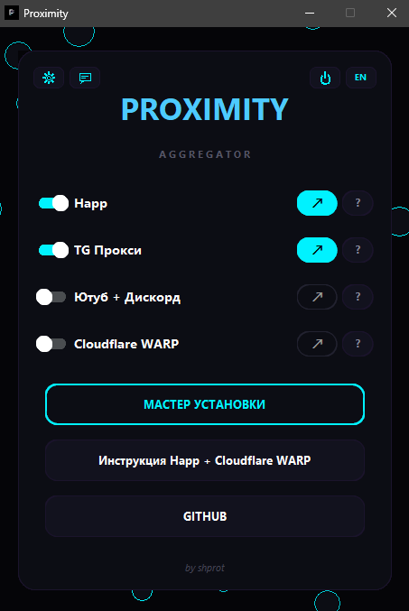
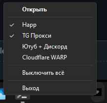
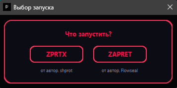
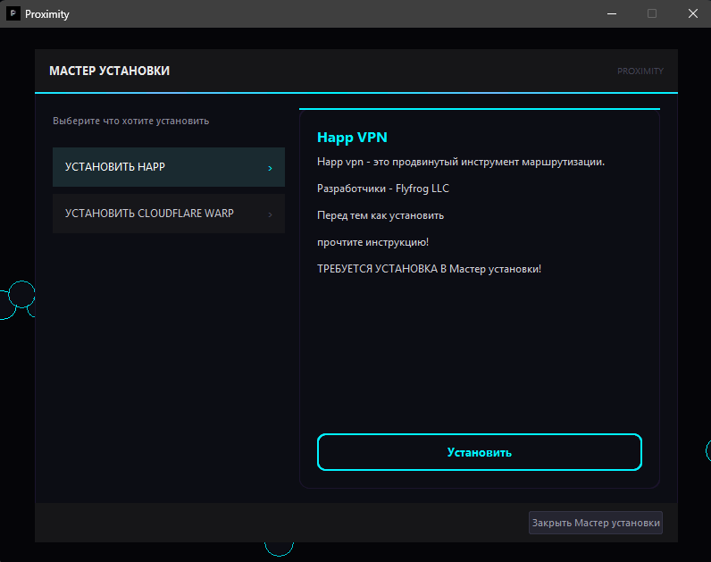
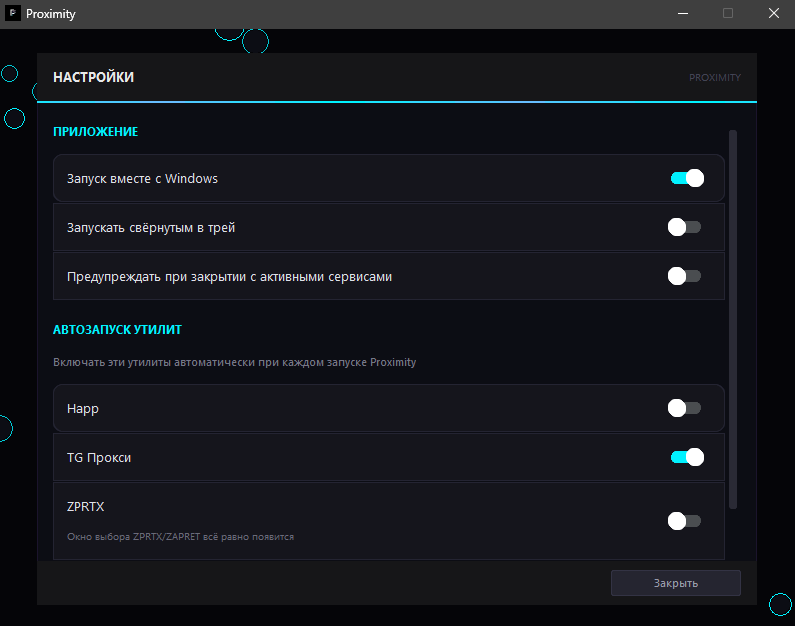

<pre>
 ───═▶   ██████╗ ██████╗  ██████╗ ██╗  ██╗██╗███╗   ███╗██╗████████╗██╗   ██╗   ◀═───
 ───═▶   ██╔══██╗██╔══██╗██╔═══██╗╚██╗██╔╝██║████╗ ████║██║╚══██╔══╝╚██╗ ██╔╝   ◀═───
 ───═▶   ██████╔╝██████╔╝██║   ██║ ╚███╔╝ ██║██╔████╔██║██║   ██║    ╚████╔╝    ◀═───
 ───═▶   ██╔═══╝ ██╔══██╗██║   ██║ ██╔██╗ ██║██║╚██╔╝██║██║   ██║     ╚██╔╝     ◀═───
 ───═▶   ██║     ██║  ██║╚██████╔╝██╔╝ ██╗██║██║ ╚═╝ ██║██║   ██║      ██║      ◀═───
 ───═▶   ╚═╝     ╚═╝  ╚═╝ ╚═════╝ ╚═╝  ╚═╝╚═╝╚═╝     ╚═╝╚═╝   ╚═╝      ╚═╝      ◀═───
</pre>

### Объединяет разные инструменты обхода блокировок под одним капотом - без ручной настройки конфигов

	 
	

		
	

# 🛰️ <a href="https://github.com/shprttx/">shprttx</a>/<a href="https://github.com/shprttx/Proximity">Proximity</a> 🛰️

**Все инструменты обхода блокировок в одном окне**  
Включил тумблер - получил обход

> [!IMPORTANT]
> Все утилиты внутри принадлежат оригинальным авторам и **регулярно обновляются**. Ссылки на них указаны в разделе [Состав](#-состав).
>
> #### Проверяйте, что запускаете. Для вашего удобства в приложении реализованно автообновление.

> [!WARNING]
>
> ### ⚠️ АНТИВИРУСЫ
> ZAPRET и ZPRTX используют WinDivert - инструмент перехвата и фильтрации трафика. Он может вызвать реакцию антивируса, но сам по себе не является вирусом.
> Добавьте папку с Proximity или сам exe в исключения антивируса.

 

<table>
<tr>
<td width="50%"></td>
<td width="50%"></td>
</tr>
</table>

 

 

## ℹ️ Как это работает

### 🎚️ Ползунки

Главные переключатели режимов обхода. Рядом с каждым есть дополнительная кнопка:

- **Happ VPN + ZPRTX** - открывает окно, если оно свёрнуто в трей
- **Остальные** - ведут на официальные страницы разработчиков

> [!WARNING]
> Если ползунок Happ не включается - создайте свой ярлык на рабочем столе.

###  Дискорд +  Ютуб

Включение тумблера открывает выбор движка, затем запускается его CMD-консоль.

> [!NOTE]
> Обход работает, пока вы вручную не переведёте ползунок в «ВЫКЛ».

🧩 <b>Выбор ZPRTX или ZAPRET</b>

 

Выберите нужный движок, и он запустится в CMD-консоли.

### 🧰 Кнопки

- ⏻ **Выключатель всего** - по очереди останавливает Happ, TG Proxy, WARP и Дискорд + Ютуб. Сопровождается красной ударной волной по фону
- 🧙 **Мастер установщик** - выборочная установка Happ VPN и Cloudflare WARP
- 📘 **Инструкция** - гайд по настройке Happ и WARP, 2 бесплатные ссылки на сервера
- 🌐 **RU / EN** - мгновенная смена языка интерфейса

🧙 <b>Мастер установки</b> - развернуть скриншот

 

Отдельное окно для выборочной установки компонентов: Happ VPN и/или Cloudflare WARP.

<table>
<tr>
<td width="50%"></td>
</tr>
</table>

🛠️ <b>Настройки</b> - развернуть скриншот

 

Тонкая настройка поведения приложения:

- автозапуск с Windows
- старт свёрнутым в трей
- предупреждение при закрытии активных сервисов
- автозапуск нужных утилит при каждом старте Proximity

<table>
<tr>
<td width="50%"></td>
</tr>
</table>

> [!TIP]
> Можно использовать любые свои или купленные конфигурационные ссылки.

## 🔐 Состав

Все инструменты **регулярно обновляются** своими авторами.

-  **[Happ VPN](https://github.com/Happ-proxy)** - продвинутый инструмент маршрутизации и конфигураций для управления трафиком. Инструкция и установщик вшиты.  
  Автор: [**Happ**](https://github.com/Happ-proxy)

-  **TG Proxy** - локальный MTProto-прокси для Telegram Desktop, ускоряет работу Telegram через WebSocket-соединения. Данные передаются в зашифрованном виде, сторонние сервера не нужны.  
  Автор: [**Flowseal**](https://github.com/Flowseal)

-  **[Cloudflare WARP](https://one.one.one.one)** - объединяет функции VPN и безопасного DNS-резолвера. Ускоряет загрузку сайтов и открывает доступ к зарубежным ИИ-моделям (Gemini, Claude, ChatGPT).  
  Автор: [**Cloudflare, Inc.**](https://one.one.one.one)

-  **ZPRTX** - сборка, объединившая версию от **Lux1de** и версию от **Flowseal**.  
  Автор: [**Shprot**](https://github.com/shprttx)

-   **ZAPRET-DISCORD-YOUTUBE** - оригинал от **Flowseal**.  
  Автор: [**Flowseal**](https://github.com/Flowseal)

 

## ⭐ Поддержка проекта

Вы можете поддержать проект, поставив ⭐ этому репозиторию (сверху справа этой страницы)

## ⚖️ Лицензирование

Проект распространяется на условиях лицензии [MIT](https://github.com/shprttx/Proximity/blob/main/LICENSE)

Made with 🖤 by <a href="https://github.com/shprttx">Shprot</a>

